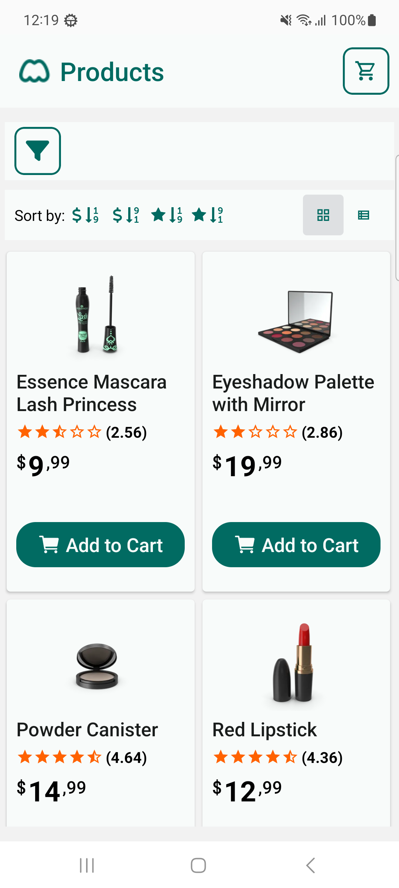
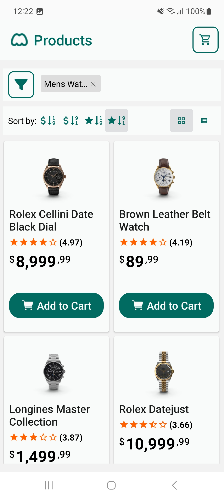
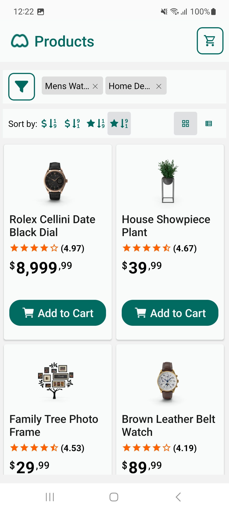
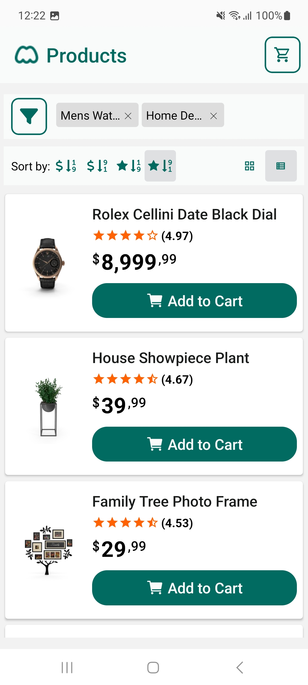
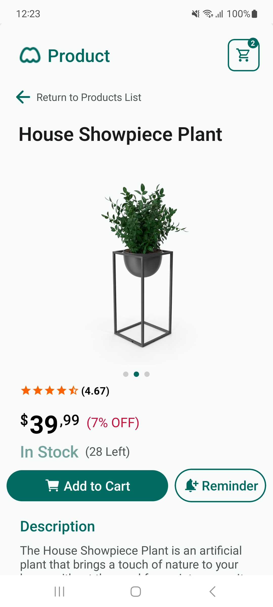
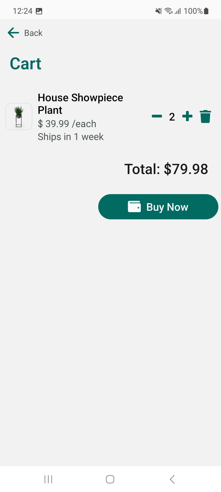

# 🛒 Modak Products - A Product Display App for Android


[](https://github.com/igoramaral)


Modak Products is an app that simulates the functionality of an store app, displaying products, letting user filters products and add products to cart.

This project was built as part of the technical challenge for the role of Mobile Engineer at [Modak](https://www.modakmakers.com). It has not affilition with the company itself.

## Built with


## 📖 Table of Contents

- [About the Project](#about-the-project)
- [Installation](#installation)
- [Usage](#usage)
- [License](#license)
- [Author](#author)

## About the Project

The main goal of the technical challenge was build a mobile application that allows a user to navigate a catalog of products by integrating with a mock API provided by [dummyJSON](https://dummyjson.com/docs/products). The user should be able to:

- View a list of products on the main screen, including the product title, price, and thumbnail.
- Filter products by category (e.g., electronics, clothing, groceries.)
- Sort the products by price or rating.
- Click on a product to view detailed information, such as product description, brand, and stock availability

This project should not focus on a visually elaborated UI, but rather be tidy, responsive and easy to navigate. I could add any cool features I wanted as long as I kept the main purpose of the application.

### Project decisions

Since this was a small project and dummyJSON presents a small set of products, I decided to load all products at once from the API and apply sorting and pagination myself. This would not be a good practice on a real situation, for this could use a lot of memory allocation that would not be good for a real app, but to keep things tidy and prevent a bunch of loadings to be presented to the screen while we fetched data from the API, i thought this could be a good decision for this project.

The project relies specifically on three hooks that are used to fetch data from the API:

- useProducts: fetches all products from the API and applies filtering, sorting and pagination when necessary.
- useCategories: fetches the category list from the API to populate category filters.
- useProduct: fetches a product from the API, loading information to display when necessary.

There are also two contexts created for this project:

- CartContext: Provides Cart context, allowing the user to see and add items to the cart throughout the app.
- NotificationsContext: Deals with local and push notifications, asking for permission when necessary.

### Added features

These features were not mandatory, but were added to enhance usability of the project:

- Cart support: The user may add products to a cart, modify quantity of a product in the cart, delete items from the cart and purchase (only cleans cart and sends the user back to main page).
- Deep Links: the app handles deep links.
- Notification support: The app handles notifications, sending local and receiving push notifications when needed. It can also deal with deeplinks sent in the notification through the url field in the data of the push notification.
- Reminder support: There's a reminder button in the product page. When clicked, it will set off a notification with a deep link to that product that will show in about 1 minute for the user.

### Screenshots

<table align="center">
  <tr>
    <td align="center"  width="250">
      <br/>
      <sub><b>Landing Page with Grid View</b></sub>
    </td>
    <td align="center"  width="250">
      <br/>
      <sub><b>Filtering Products by Category and Sorting by price</b></sub>
    </td>
    <td align="center"  width="250">
      <br/>
      <sub><b>Filtering by more then one Category and sorting by rating</b></sub>
    </td>
  </tr>
  <tr>
    <td align="center"  width="250">
      <br/>
      <sub><b>Filtering by more then one Category and sorting by rating with List view</b></sub>
    </td>
    <td align="center"  width="250">
      <br/>
      <sub><b>Product information page</b></sub>
    </td>
    <td align="center" width="250">
      <br/>
      <sub><b>Cart page</b></sub>
    </td>
  </tr>
</table>

## Installation

1. Clone repository:

   ```bash
   git clone https://github.com/igoramaral/modak-products.git && cd modak-products
   ```

2. Install dependencies

   ```bash
   npm install
   ```

3. Start the server app

   ```bash
   npx expo start
   ```

## Usage

You will need a development build installed on a real device for running the app. Simply running with Expo Go wont help, because it cannot handle Deep Linking and Notifications correctly. You may find a development build [here](https://expo.dev/accounts/igoramaral/projects/modak-products/builds/78fca733-a98b-4dc5-bf6a-b45694bbc8f3).

Once downloaded and installed on your real device, start the Development Server with the instructions provided on [Installation](#installation). Once the server is up and running, open the app on your phone. You should see the development server on the app. If you don't, try reopening the app. Once the development server is selected, the app will bundle and start.

### Push Notifications

To send push notifications, you will need the Token. This token will print on the console of the server once the app is running and looks like this:

   ```
   ExponentPushToken[SomethingHere12345]
   ```

You can either use the [Expo Notification Tool](https://expo.dev/notifications) or send a POST request with curl. You may provide a url on the data field to send a deep link that will be opened once the notification is tapped. Note that the deep link must be valid or a "Page not Found" page will be shown on the app.

   ```
   curl --location 'https://exp.host/--/api/v2/push/send' \
--header 'Content-Type: application/json' \
--data '{
    "to": "YourTokenHere",
    "sound": "default",
    "title": "Notification Title",
    "body": "Notification Body",
    "data": { "url": "category/vehicle (OPTIONAL)" }
  }'
  ```

### Deep Linking

If you just wish to test deep links, you may do so by running on the console:

   ```
   npx uri-scheme open modakproducts://category/beauty --android
   ```

To make sure your deep link works, you need to use a valid path — otherwise you’ll see the “Page Not Found” screen.

Here are some valid deep link paths you can try:

| Path                              | What it does                                    | Example values                                |
| --------------------------------- | ----------------------------------------------- | --------------------------------------------- |
| `modakproducts://category/{name}` | Opens the product list for a specific category  | `beauty`, `vehicle`, `furniture`, `groceries` |
| `modakproducts://product/{id}`    | Opens the product page for the given product ID | `1`...`194`                             |
| `modakproducts://cart`            | Opens your cart page                            | —                                             |

## License

Licensed under ISC license.

## Author

**Igor Dominices Baía do Amaral**

[](https://github.com/igoramaral)
[](https://www.linkedin.com/in/igor-db-amaral/)
